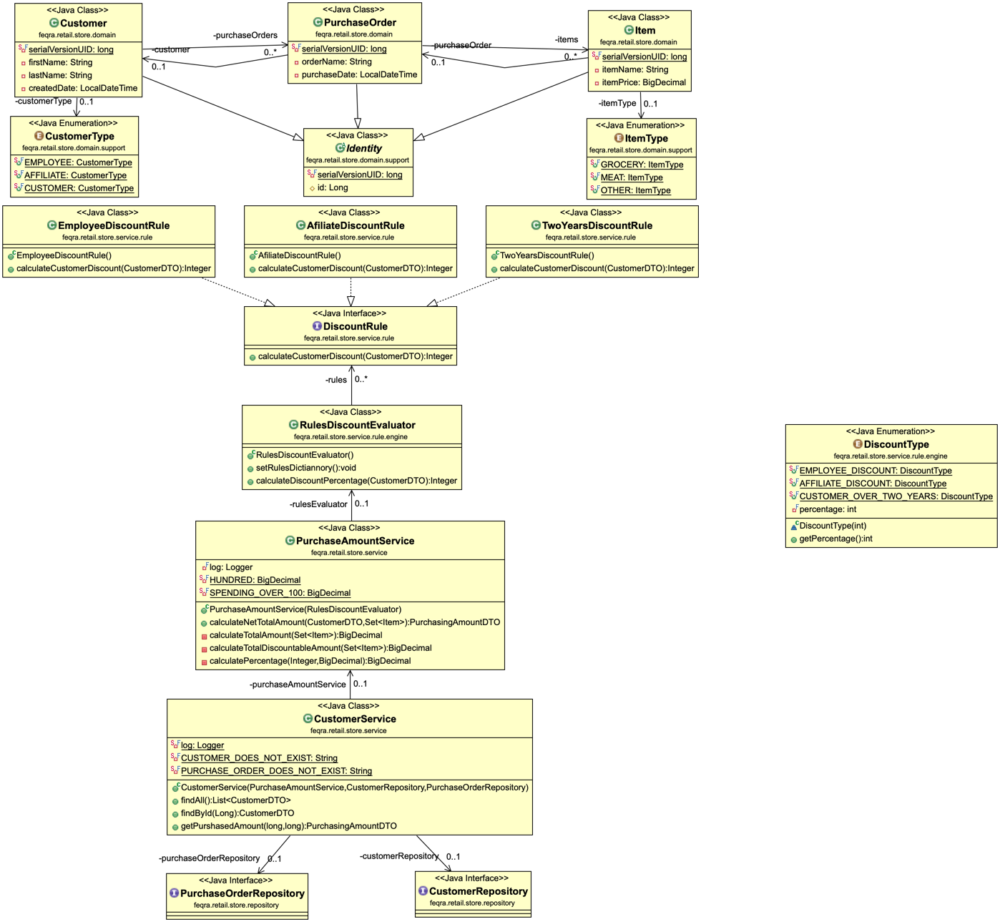
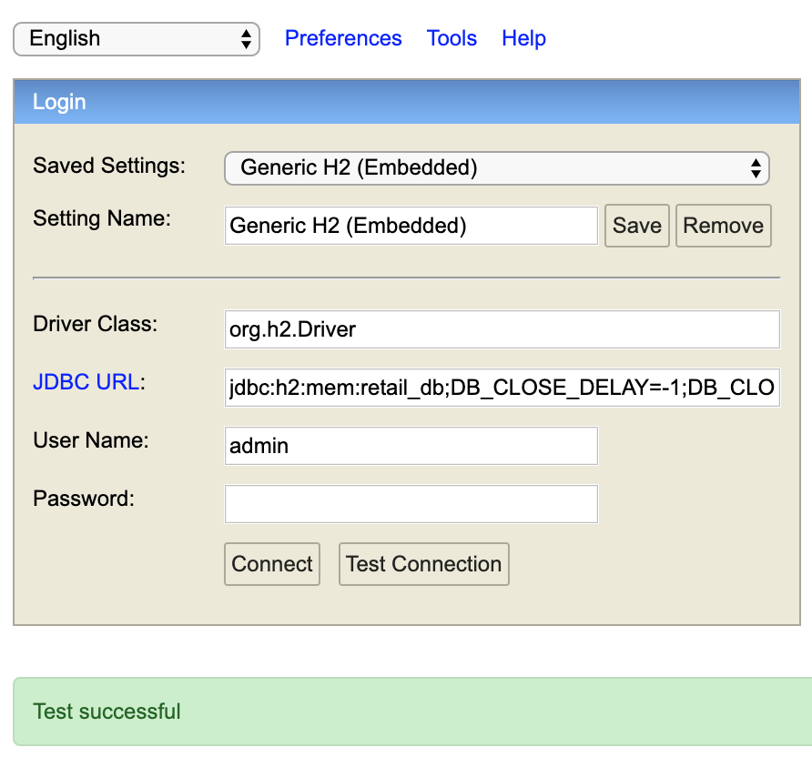
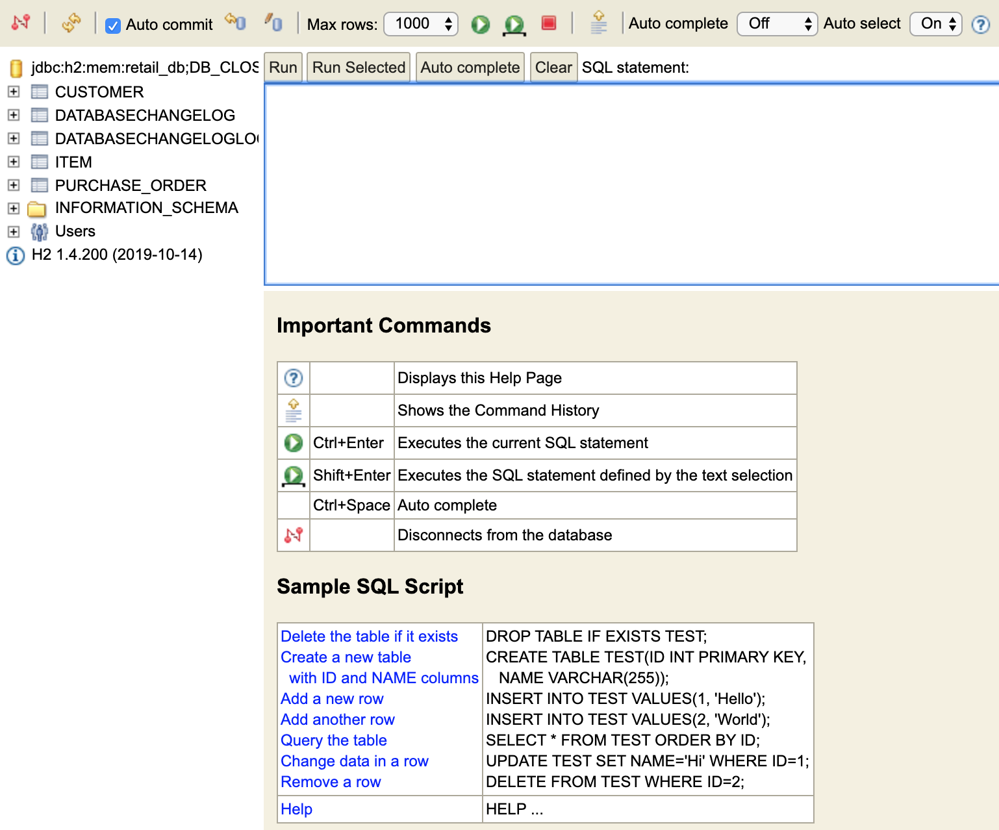
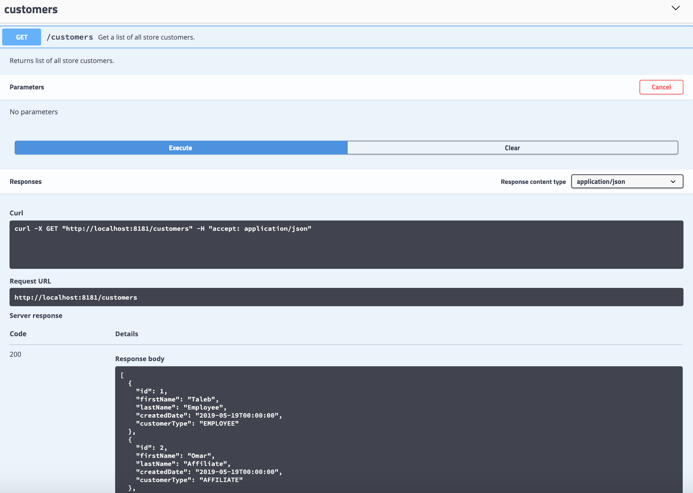

# retail-store-discounts

# Retail Store Discount Application

This is an application to calculate discount depending on discount for different
types of users, following specific discount rules:
- User of type "Employee" have 30% discount on the bill
- User of type "Affiliate" have 10% discount on the bill
- User of type "Customer" (or simple user), who is registered for over 2 years, is eligible
for 5% discount on the bill
- If the order contains groceries, no percentage discount is available.
- User, who is eligible to several discounts, can take only one (with biggest percent).
- There is another type of discount which is based on amount, not on the user role, as follows:
for every 100 on the bill, there will be 5 discount, e.g. bill 990, 45 is the discount

### Prerequisites

- Java 8 and above
- Maven

### Installing

######Checkout the project from git

```
git clone https://github.com/dahan5/retail-store-discounts.git
```

######To run the application
```
mvn spring-boot:run
```

######To run tests

```
mvn clean install
```
## Docker

```bash
mvn clean
mvn package docker:build
mvn docker:run
```

### Tooling
- Swagger - API documentation
- Jacoco - test report / test coverage
- H2 - in memory DB for this demo

## API documentation
http://localhost:8181/swagger-ui.html

### Demo Data
- url: jdbc:h2:mem:retail_db;DB_CLOSE_DELAY=-1;DB_CLOSE_ON_EXIT=FALSE
- driver-class-name: org.h2.Driver
- username: admin
- password: admin
The in-memory database is accessible at `http://localhost:8181/db-console`

### Sample request flow
- To have a full idea about the API URLs to be called, use Swagger API documentation and you will have an idea about the available endpoints for this project.

### Documents
- UML Class Diagram - Discount Processing

- H2 in-memory database


- Swagger API documentation


## Sonar results
https://sonarcloud.io/dashboard?id=dahan5_retail-store-discounts

## Built With

* [Java](http://jdk.java.net/14/) - The language Java
* [Spring Framework](https://spring.io/) - Spring framework

## Authors

* **Taleb DAHAN**

## License

This project is licensed under the MIT License - see the [LICENSE.md](LICENSE.md) file for details

## Acknowledgments

* Thanks for the challenge


